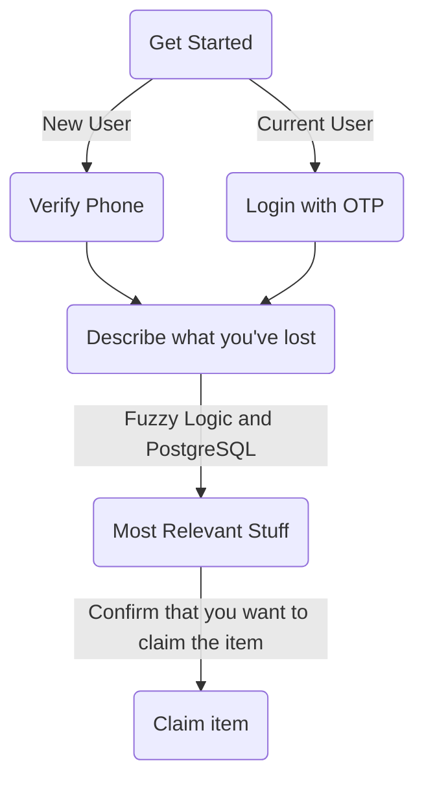

# finders-keepers
Project for Hacklahoma 2025

## Inspiration
One of our members has a habit of losing their things. he once lost his airpods in a coffee shop, lost his 
glasses to the kansas wind and much more. In true Comp Sci fashion, we thought of creating an app for college
students to report mising items on a single platform, using elements of fuzzy logic. One can search for items
and contact the person who reported the item as lost to get it back.

## Tech Stack
Front end
  - React native
      For seamless UI on any operating system for phones. Fucntion calls to
      map and and expo camera
  - JavaScript
      Internal logic
  - OpenAi Vision
      Describes image tokens passed through it to populate various
      attribute fields in tables
  - Twilio and Firebase
      Authentication and verification of phone numbers

Back end
  - PostGre SQL
      Stores data attributes of lost itme like location, picture, time, userID, title, description. Claimed items
      have their own table.
  - ExpressJS with axios
      API endpoint pipelineing

## Use case

## Features

## On the Horizon

