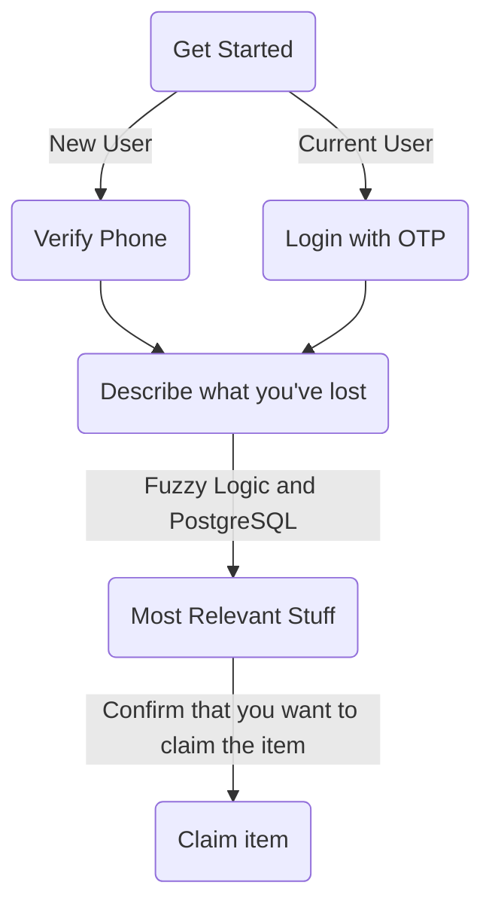

# finders-keepers
Project for Hacklahoma 2025

## Inspiration
We all know the feeling of sudden panic when you realize something is missing. You check your pockets, your bag, retrace your steps, but it’s nowhere to be found. Now imagine that happening all the time—that’s life for one of our team members. He’s lost his AirPods in a coffee shop, lost his glasses to the Kansas wind, and misplaced more things than we can count.

Instead of just sympathizing (by endlessly teasing him), we decided to do what Comp Sci students do best—solve the problem with tech. Our Solution? A mobile app designed specifically for college students to report lost items, map their locations, and connect with finders in real time.

While we can’t change our friend’s clumsiness, we can make losing things a little less stressful and finding them a whole lot easier.
## Tech Stack
Front end
  - React native
      For seamless UI on any operating system for phones. Fucntion calls to
      map and and expo camera
  - JavaScript
      Internal logic
  - OpenAi Vision
      Describes image tokens passed through it to populate various
      attribute fields in tables
  - Twilio and Firebase
      Authentication and verification of phone numbers

Back end
  - PostGre SQL
      Stores data attributes of lost itme like location, picture, time, userID, title, description. Claimed items
      have their own table.
  - ExpressJS with axios
      API endpoint pipelineing

## Use case
This mobile app makes it easier for people to find and return lost items. When someone finds a lost item, they can take a picture, upload it to the app, and pin its location on a map.

The app uses **OpenAI Vision API** to analyze the image and generate a description. It then stores important details like the lost date, location, and item description in a database.

If someone is looking for their lost item, they can enter a description in the app. In the background, the app uses fuzzy logic to match their input with reported found items. If there’s a match, the app pinpoints the item’s location on the built-in map, making it easy for the owner to retrieve it.

